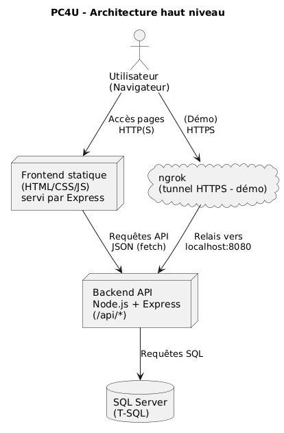
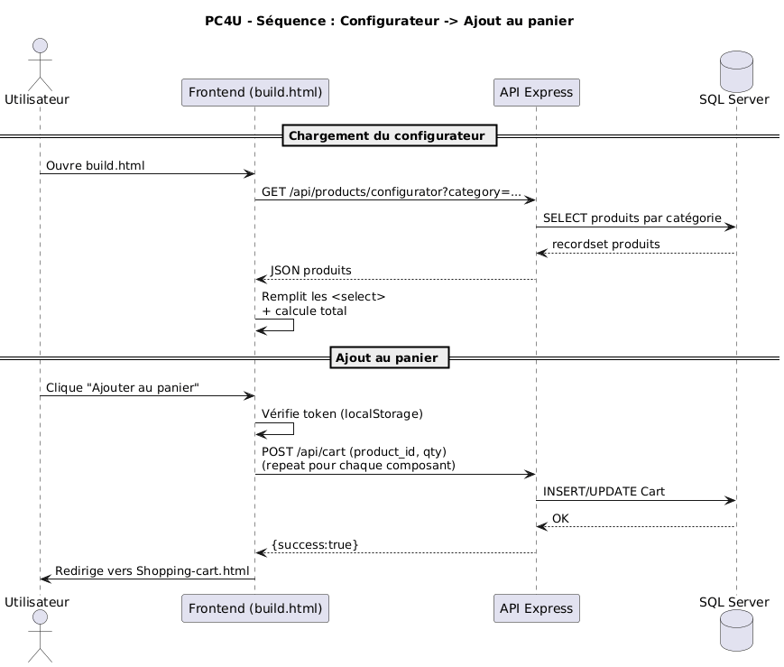

# Architecture - <PC4U>

## 1. Contexte et objectifs
- **Objectif du système** : Le but de PC4U est d'offrir une plateforme alternative pour l'achat et la configuration de 
    composants d'ordinateurs, offrant un système complet permettant un filtrage puissant des composantes et de leurs 
    spécifications.
- **Utilisateurs cibles** : Majoritairement ciblés vers les gamers ou individus travaillant à leur compte en informatique,
    leur permettant d'avoir un éventail large de produits accessibles à eux.

## 2. Vue d'ensemble
### Stack technique
- **Frontend** : HTML, CSS, JavaScript
- **Backend** : Node.js, Express
- **Base de données** : SQL Server (Transact-SQL)
- **Authentification** : JWT (header `Authorization: bear <token>`)
- **Déploiement** : Ngrok (pendant `npm run dev`)

### Diagrammes
**Diagramme d'architecture haut niveau**

**Diagramme de séquence: exemple de cas d'utilisation: Configurateur -> Panier**

## 3. Composants
**3.1 Frontend**
* Rôle : Affiche la vue du site à l'utilisateur et transforme à travers CSS. Affiche les pages et déclenche les actions(recherche, filtres, panier, login) et communique avec l'API backend avec fetch
* Pages principales :
            build.html (page de configuration et création de templates)
            index.html (page d'entrée du site)
            login.html (page de connexion pour utilisateur existant)
            register.html (page de création de compte)
            products.html (page montrant la liste des produits, permet d'accéder aux filtres)
            productdetail.html (page accédée à travers products.html, donne les spécifications du produit)
            shoppingcart.html (page du panier montrant les produits inclus dans la commande actuelle, avant qu'elle soit passée.)
            orderconfirmation.html (page de confirmation de commande)
* Gestion d'état (localStorage) :
            `pc4u_token` : JWT
            `pc4u_user` : infos utilisateur (JSON)
            `pc4u_last_transaction` : transaction temporaire pour la page de confirmation
* Appels API :
            `GET /api/products` (catalogue complet)
            `GET /api/products/filter` : filtres avancés
            `GET /api/products/:id` (détails + specs)
            `POST /api/cart`, `GET /api/cart`, `DELETE /api/cart`, `DELETE /api/cart/:cartId`
            `POST /api/cart/checkout` : création de transaction + détails + vidage panier
            `POST /api/auth/login`, `POST /api/auth/register`, `GET /api/auth/me`
            `... /api/cart` (panier)
**3.2 Backend**
* Rôle : Fournit une API REST qui gère la connexion entre le frontend et la base de données. Elle envoie les requêtes SQL à SQL Server pour récupérer les informations sur les utilisateurs, les produits, leurs specs, les templates.
* Framework :
            **Node.js + Express** (serveur et routage)
            **mssql** (connexion et requêtes SQL)
            **jsonwebtoken** (pour la création et validation des JWT)
            **cors, doteven et path**
* Structure :
            `backend/src/app.js` :
                - configuration Express (CORS, JSON)
                - montage des routes `/api/*`
                - service du frontend statique via `express.static(...)`
                - endpoint de santé `GET /api/health`
            `backend/src/db.js` :
                - connexion à SQL Server + export `sql` (pool/driver)
            `backend/src/middleware/auth.js` :
                - middleware de protection des routes via header
            `Authorization: Bearer <token>` (validation `JWT_SECRET`)
             `backend/src/routes/` :
                - `auth.js` : login/register + endpoint `/me` (validation token)
                - `products.js` : catalogue, filtres avancés, fiche produit + specs
                - `cart.js` : CRUD panier + checkout (Transactions + Transaction_Details)
                - `prebuilt.js` : templates (CRUD + chargement d’un template)
* Validation des entrées :
            - Vérification des paramètres requis (ex: `product_id` dans `POST /api/cart`,
                `cartId` numérique dans `DELETE /api/cart/:cartId`)
            - Nettoyage/conversion des types côté serveur (`Number(...)`, `parseInt(...)`)
            - Requêtes SQL paramétrées via `.input(...)` pour réduire le risque d’injection SQL
* Gestion des erreurs et logs :
            - `try/catch` dans les routes, log serveur via `console.error(...)`
            - Réponses JSON d’erreur: `{ error: "...", detail: err.message }`
            - 404 renvoyé en JSON pour les routes inconnues (`{ error: 'Route introuvable' }`)

**3.3 Base de données**
* SGBD : SQL Server Management Studio 20
* Rôle : Stocke les utilisateurs, les produits, leurs spécifications, le panier, les transactions et les templates. 
* Principales tables :
- Users
    * user_id_number PK,
    * user_pseudo,
    * email,
    * user_password,
    * register_date,
    * user_type_id,
    * FK (user_type_id) REFERENCES UserTypes
                        Categories
    * category_id PRIMARY KEY,
    * category_name
                        Products
    * product_id PRIMARY KEY,
    * product_name,
    * category_id,
    * product_price,
    * stock,
    * image_url,
    * FK (category_id) REFERENCES Categories
- Cart
    * cart_idPRIMARY KEY,
    * user_id_number,
    * product_id,
    * quantity INT,
    * FK (user_id_number) REFERENCES Users,
    * FK (product_id) REFERENCES Products
- Transactions
    * transaction_idPRIMARY KEY,
    * transaction_date,
    * total_items,
    * total_cost,
    * user_id_number,
    * FK (user_id_number) REFERENCES Users
- Transaction_Details
    * details_idPRIMARY KEY,
    * transaction_id,
    * product_id,
    * product_quantity,
    * price_at_purchase,
    * line_total,
    * FK (transaction_id) REFERENCES Transactions,
    * FK (product_id) REFERENCES Products
- Tables de spécifications des produits
    * CPU_Specs,
    * GPU_Specs,
    * Monitors_Specs,
    * Memory_Specs,
    * Hard_Drive_Specs,
    * Power_supply_Specs,
    * Case_Specs
    * Motherboard_Specs,
- Tables des builds
    * Templates,
    * Template_Components
* Relations importantes :
            - Users <-> Cart <-> Produits
            - Users <-> Transactions <-> Transaction_Details
            - Products <-> X_Specs
            - Users <-> Templates <-> Template_Components
* Conventions et contraintes :
            - Clés primaires IDENTITY permettant d'incrémenter automatiquement lors de l'ajout d'utilisateurs, produits, ou paniers
            - Contraintes
                prix >= 0
                stock >= 0
                quantité >= 0